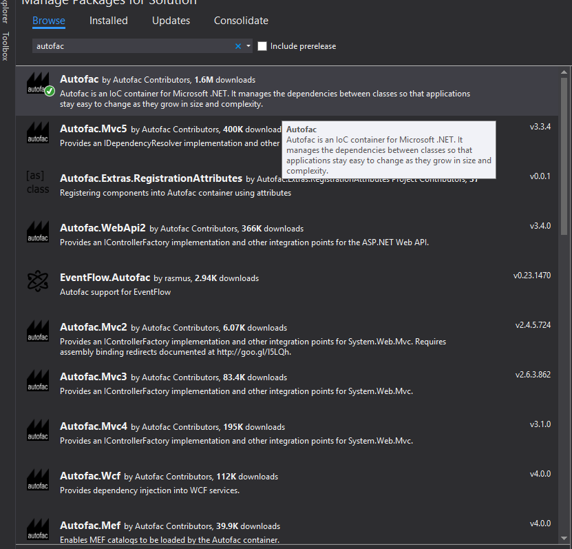

#HQF.Tutorial.IOC
The Solution is to demo the IOC components .

##Intruduction
##Autofac

###More pakages using Autofac

###Unity
The Unity Container (Unity) is a lightweight, extensible dependency injection container. It facilitates building loosely coupled applications and provides developers with the following advantages:

 - Simplified object creation, especially for hierarchical object structures and dependencies
 - Abstraction of requirements; this allows developers to specify dependencies at run time or in configuration and simplify management of crosscutting concerns
 - Increased flexibility by deferring component configuration to the container
 - Service location capability; this allows clients to store or cache the container
 - Instance and type interception
 - Registration by convention

[The Unity Configuration Schema](https://msdn.microsoft.com/en-us/library/ff660914.aspx)     

##Windsor
Castle Windsor is a best of breed, mature Inversion of Control container available for .NET and Silverlight.

The current version is 3.3.0, released in May 2014. Refer to the links on the right to download it from GitHub or NuGet.
To learn more about Windsor see its documentation page.

##Sping.Net

##Office WebSite
[Autofac](http://autofac.org/)  
[Unity](https://unity.codeplex.com/)   
[MEF](https://mef.codeplex.com/)    
[Ninject](http://www.ninject.org/) 
[windsor](http://www.castleproject.org/projects/windsor/)   
